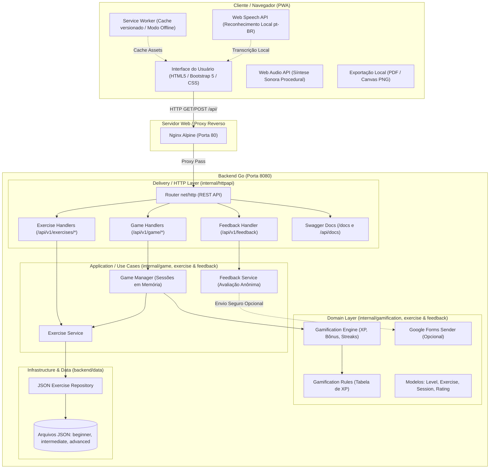
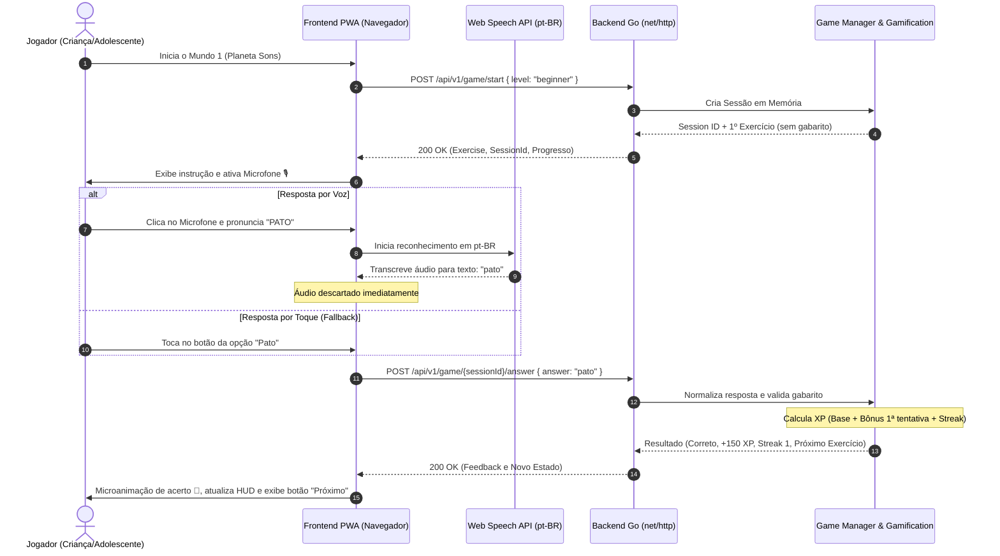

# Arquitetura — Falaêh

Este documento descreve a arquitetura do **Falaêh**, uma Progressive Web App (PWA) gamificada para exercícios fonoaudiológicos, com foco em crianças e adolescentes.

---

## 1. Visão Geral e Princípios

O projeto adota uma **Clean Architecture pragmática**, orientada pelos princípios **KISS** (*Keep It Simple, Stupid*) e **YAGNI** (*You Aren't Gonna Need It*), em conformidade com o *Uber Go Style Guide*.

### Diretrizes Arquiteturais:
- **Sem overengineering**: sem microserviços, sem mensageria, sem banco de dados relacional ou NoSQL nesta versão.
- **Frontend leve e sem SPA complexo**: HTML5, CSS3 moderno, Bootstrap 5 e Vanilla JavaScript orientado a módulos.
- **Zero armazenamento de dados pessoais**: sem autenticação, sem login, sem cookies de rastreamento e sem armazenamento/gravação de áudio.
- **Domínio isolado**: as regras de pontuação, XP, sequências (*streak*), conquistas e progressão residem exclusivamente no backend em Go.
- **Alta testabilidade**: suíte completa de testes unitários e de aceitação com cobertura global mínima garantida de 80%.

---

## 2. Diagrama de Arquitetura

O sistema é dividido em camadas concêntricas onde as dependências apontam sempre para o centro (regras de negócio):



---

## 3. Estrutura de Pacotes do Backend

A estrutura interna segue a separação estrita por responsabilidade:

```
backend/
├── cmd/
│   └── api/
│       └── main.go                 # Ponto de entrada HTTP, wiring de dependências e graceful shutdown
├── internal/
│   ├── exercise/                   # Domínio e repositório de exercícios (carregamento JSON e validação de fala/texto)
│   │   ├── exercise.go             # Entidades (Level, Type, Exercise), validações e NormalizeAnswer()
│   │   ├── repository.go           # JSONRepository com carregamento e validação no startup
│   │   └── service.go              # Casos de uso de busca e validação de exercícios
│   ├── feedback/                   # Avaliação opcional e anônima da experiência (ETAPA 13)
│   │   └── feedback.go             # Ratings fechados, Service e Sender do Google Forms
│   ├── gamification/               # Domínio puro de pontuação, XP, sequência e conquistas
│   │   ├── rules.go                # Tabela centralizada de constantes de XP e limiares de streak
│   │   ├── xp.go                   # Funções puras de cálculo de XP
│   │   ├── achievement.go          # Conquistas desbloqueadas
│   │   ├── progress.go             # Acompanhamento de acertos, erros e acurácia
│   │   └── engine.go               # Motor de cálculo de gamificação
│   ├── game/                       # Máquina de estados das partidas em memória
│   │   ├── session.go              # Entidade Session com expiração por inatividade e relatório final
│   │   └── manager.go              # Criação, progressão de exercícios e conclusão de fase
│   ├── httpapi/                    # Camada Delivery (net/http padrão, sem framework pesado)
│   │   ├── router.go               # Definição de rotas e headers de segurança
│   │   ├── game.go                 # Handlers para /api/v1/game/start e answer
│   │   ├── exercises.go            # Handlers para /api/v1/levels e /api/v1/exercises
│   │   ├── feedback.go             # Handler anônimo para /api/v1/feedback
│   │   └── docs.go                 # Endpoint do Swagger UI embutido

└── data/                           # Banco de dados baseado em arquivos JSON versionados
    ├── beginner.json               # Nível 1: Planeta Sons (Fonemas bilabiais /P/, /B/, /M/)
    ├── intermediate.json           # Nível 2: Vale das Palavras (Encontros consonantais /TR/, /PR/, fricativos)
    └── advanced.json               # Nível 3: Galáxia da Fala (Trava-línguas e frases de dicção)
```

---

## 4. Fluxo da Rodada do Jogo

O fluxo abaixo detalha o ciclo de vida de uma resposta e a interação por voz ou toque:



---

## 5. Reconhecimento de Fala e Privacidade

1. **Processamento no Cliente**: A Web Speech API roda localmente no navegador. Nenhum fluxo de áudio é enviado para o servidor ou gravado em disco.
2. **Normalização Fonética**: A função `NormalizeAnswer` no Go e `normalizeSpeechText` no JavaScript removem pontuações e espaços supérfluos e convertem tudo para caixa baixa antes da comparação textual.
3. **Resiliência / Fallback**: Se o navegador não suportar reconhecimento de fala, o microfone falhar ou a criança preferir tocar, os botões de resposta múltipla escolha permanecem sempre visíveis e funcionais.
4. **Isenção Clínica**: A aplicação enfatiza visualmente seu propósito lúdico-educativo, não constituindo avaliação diagnóstica de fonoaudiologia.

---

## 6. Geração Local de Relatórios e Certificados

Ao concluir um mundo, o relatório e o certificado são gerados exclusivamente no frontend:
- **PDF**: formatado com CSS `@media print` para folha A4 com tipografia nítida e sem botões.
- **Imagem PNG**: renderizada em alta resolução (1200x950px) em elemento `<canvas>` HTML5 com o nome personalizado do jogador, dados de XP, taxa de acerto e maior sequência.
- **Privacidade**: o nome digitado não é enviado para o backend nem armazenado no servidor.

---

## 7. Design System e Ergonomia Visual (8pt Grid System)

A interface da aplicação adota formalmente o **8-Point Grid System** (com subgrid de 4pt), fundamentando as decisões visuais em normas de IHC (Interação Humano-Computador) e nas diretrizes Google Material Design, Apple HIG e WCAG:

### Tabela de Design Tokens no CSS (`:root`)

| Token | Valor | Multiplicador | Uso Recomendado |
| :--- | :--- | :--- | :--- |
| `--space-1` | `4px` | $0.5 \times 8$ (Subgrid) | Espessura de foco acessível, microgaps inline |
| `--space-2` | `8px` | $1 \times 8$ (Base) | Margem entre ícone e texto, gap compacto |
| `--space-3` | `12px` | $1.5 \times 8$ (Subgrid) | Padding vertical de botões médios |
| `--space-4` | `16px` | $2 \times 8$ ($1\text{rem}$) | Padding de containers, gap entre cards, base Bootstrap |
| `--space-5` | `20px` | $2.5 \times 8$ | Padding interno de cards no mobile |
| `--space-6` | `24px` | $3 \times 8$ | Padding interno de cards no desktop, gap de formulário |
| `--space-7` | `32px` | $4 \times 8$ | Padding de telas comemorativas e modais |
| `--space-8` | `40px` | $5 \times 8$ | Padding horizontal de botões primários |
| `--space-9` | `48px` | $6 \times 8$ (`--target-touch-min`) | Alvo de toque mínimo WCAG AAA |
| `--space-10` | `56px` | $7 \times 8$ (`--target-touch-lg`) | Altura de botões primários de ação ("Começar", "Próximo") |
| `--size-badge-icon` | `72px` | $9 \times 8$ | Dimensão dos emblemas circulares dos mundos |
| `--size-mic-btn` | `88px` | $11 \times 8$ | Botão central do microfone de voz |

### Benefícios Técnicos e de UX
1. **Prevenção de Subpixel Rendering**: Resoluções modernas em smartphones e tablets utilizam densidades de tela 2x, 3x ou 4x DPR. Múltiplos inteiros de 4 e 8 eliminam anti-aliasing borrado em bordas e ícones.
2. **Ergonomia Infantil**: Crianças em fase de desenvolvimento motor se beneficiam de alvos de toque generosos ($\ge 48\text{px}$), reduzindo toques involuntários e frustrações.
3. **Responsividade Previsível**: A largura da aplicação permanece 100% fluida (CSS Grid / Flexbox), enquanto os espaçamentos e alturas mínimas utilizam os degraus matemáticos da escala entre mobile e desktop.
